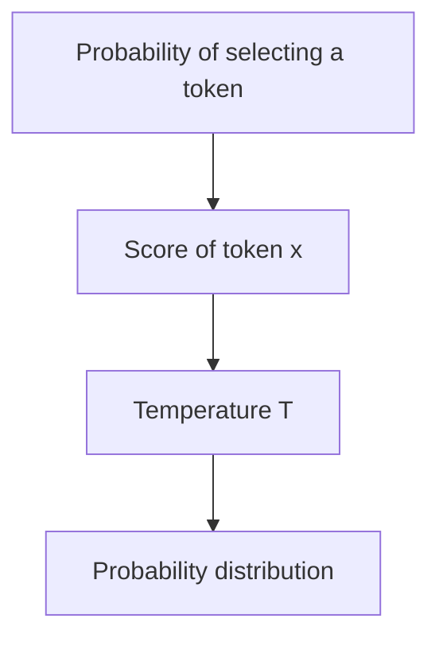
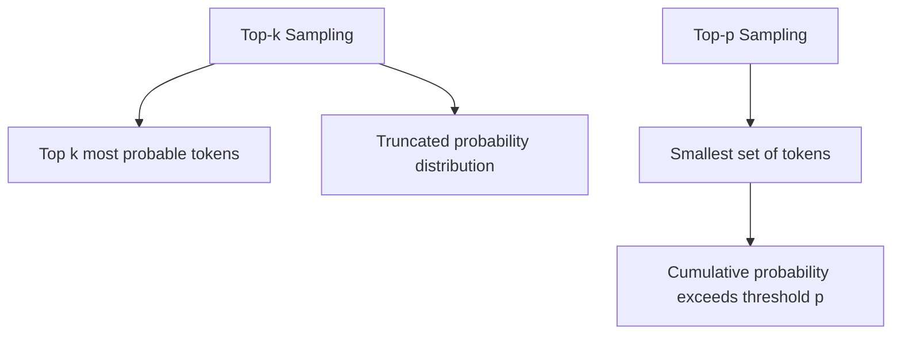
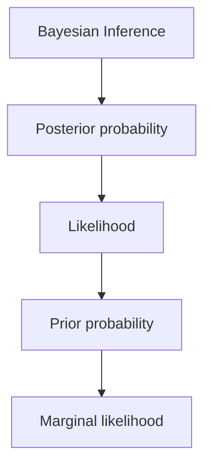
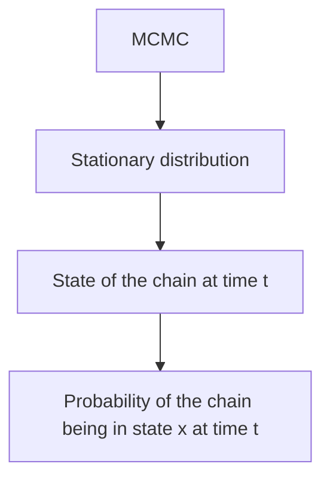

# Tokyo Explorer + AI

## Description
Tokyo Explorer + AI is a Rust application that provides an interactive experience for exploring Tokyo with the help of AI-generated content.

## Installation
To build the project, run the following command:

```bash
cargo build
```

## Usage
After building the project, you can run the application to explore Tokyo and ask questions about the city.

## Dependencies
This project uses the following dependencies:
- tokio
- colored
- rand
- dotenv
- reqwest
- serde
- serde_json

## Mathematical Concepts

### Probability Distributions
The temperature parameter T controls the randomness of the AI's responses. A higher temperature results in more random outputs, while a lower temperature makes the output more deterministic.



### Statistical Sampling
**Top-k Sampling:**
In top-k sampling, the model selects from the top k most probable tokens. The probability distribution is truncated to these tokens.

**Top-p Sampling (Nucleus Sampling):**
In top-p sampling, the model selects from the smallest set of tokens whose cumulative probability exceeds a threshold p.



### Bayesian Inference
Bayesian inference is a statistical framework for updating the probability of a hypothesis based on new evidence.



### Markov Chain Monte Carlo (MCMC)
MCMC is a class of algorithms for sampling from a probability distribution.



<script type="text/javascript" async
  src="https://cdnjs.cloudflare.com/ajax/libs/mermaid/8.13.10/mermaid.min.js">
</script>
