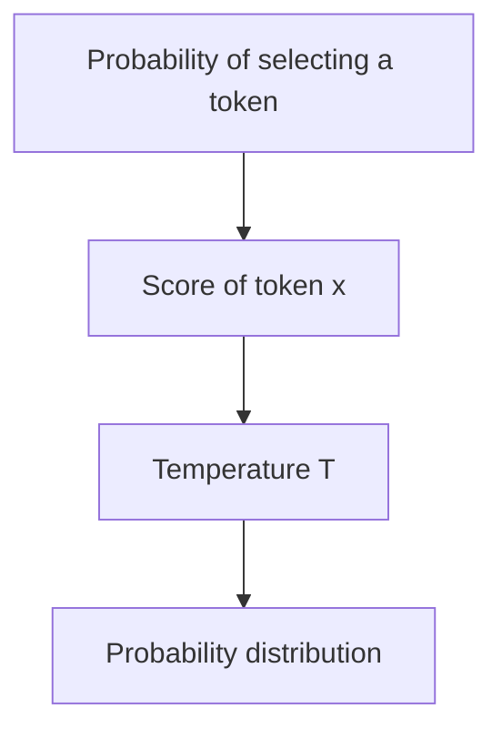
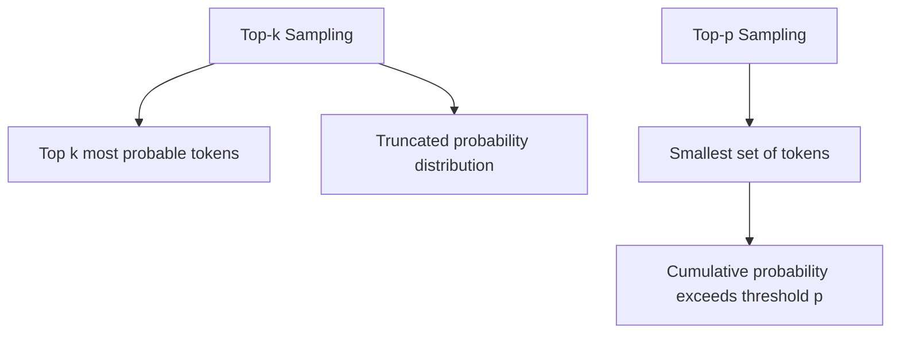
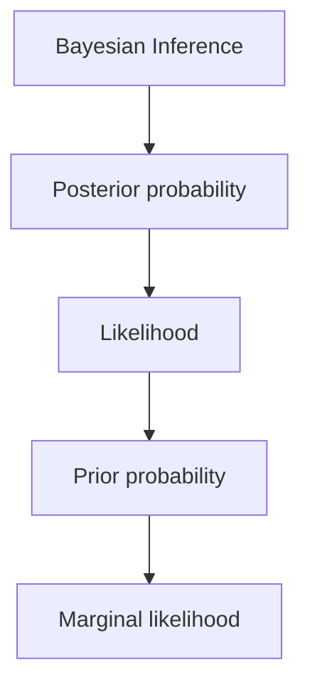
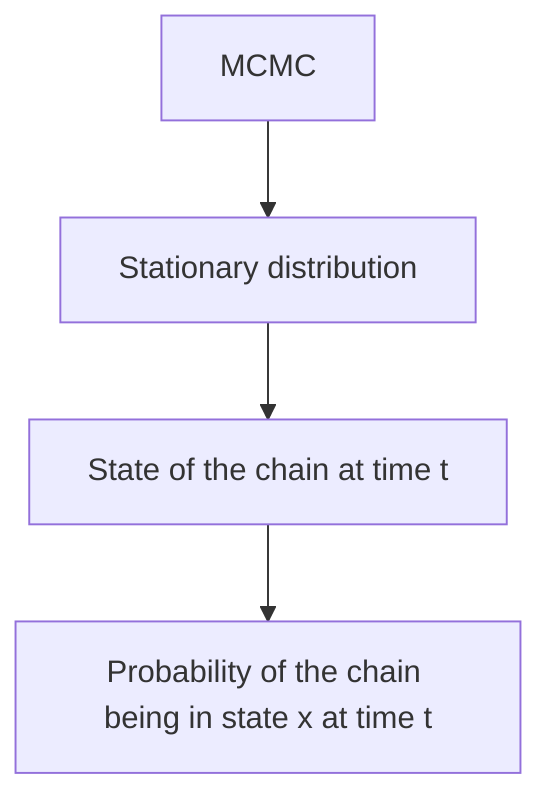
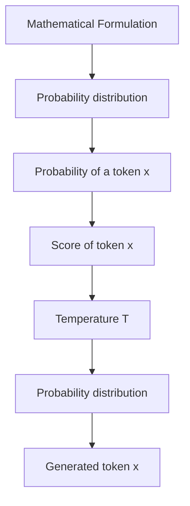

# Tokyo Explorer + AI

## Description
Tokyo Explorer + AI is a Rust application that provides an interactive experience for exploring Tokyo with the help of AI-generated content.

## Installation
To build the project, run the following command:

```bash
cargo build
```

## Running the Project
To run the Rust application, use the following command:
```bash
cargo run
```

To keep your local repository updated, use:
```bash
git pull
```

## Usage
After building the project, you can run the application to explore various aspects of Tokyo, including AI-generated itineraries, cultural insights, and more.

## Feedback
We value your feedback! Feel free to reach out on: [LinkedIn](https://www.linkedin.com/in/bniladridas) to share your thoughts or suggestions about the project.

## Dependencies
This project uses the following dependencies:
- tokio
- colored
- rand
- dotenv
- reqwest
- serde
- serde_json

## Security Notice
Please ensure that your `.env` file, which may contain sensitive information such as API keys, is kept secure and not shared publicly. Do not include the `.env` file in your version control system.

## Enhancements to Gemini API Interaction

### Prompt Engineering
To improve the quality of responses from the Gemini API, we enhanced the prompts sent to the API by providing more context. This helps guide the model towards generating more relevant and engaging responses. For example, prompts are now formatted as follows:

```rust
let enhanced_prompt = format!("As an exotic guide to Tokyo, can you provide insights on: {}", prompt);
```

### API Parameter Adjustments
We also adjusted several parameters in the API request to influence the creativity and length of the responses:
- **Temperature:** Set to `0.7` to allow for more creative responses.
- **Top K:** Adjusted to `50` to limit the number of candidate responses.
- **Max Output Tokens:** Reduced to `150` to ensure concise responses.

These changes aim to enhance the overall user experience by providing richer and more informative interactions with the AI.

## Model Used
This project utilizes the **Gemini-2.0-pro-exp-02-05** model from the Gemini API for generating AI responses. The model is designed to provide informative and engaging interactions about Tokyo, leveraging advanced natural language processing capabilities.

## Crucial Git Commands

Here are some important Git commands used in this project:

1. **Initialize a Git Repository:**
   ```bash
   git init
   ```

2. **Add Files to Staging:**
   ```bash
   git add .
   ```

3. **Commit Changes:**
   ```bash
   git commit -m "Your commit message"
   ```

4. **Push Changes to Remote Repository:**
   ```bash
   git push -u origin branch-name
   ```

5. **Fetch Updates from Remote:**
   ```bash
   git fetch origin
   ```

6. **Switch to a Branch:**
   ```bash
   git checkout branch-name
   ```

7. **Create and Switch to a New Branch:**
   ```bash
   git checkout -b new-branch-name
   ```

8. **Clone a Repository:**
   ```bash
   git clone https://github.com/username/repo-name
   ```

9. **Force Push Changes:**
   ```bash
   git push --force
   ```

10. **Amend Last Commit:**
    ```bash
    git commit --amend -m "Updated commit message"
    ```

11. **Check Status of Repository:**
    ```bash
    git status
    ```

12. **Pull Repository:**
    ```bash
    git pull
    ```

## Mathematical Concepts

### Probability Distributions
The temperature parameter T controls the randomness of the AI's responses. A higher temperature results in more random outputs, while a lower temperature makes the output more deterministic.



### Statistical Sampling
**Top-k Sampling:**
In top-k sampling, the model selects from the top k most probable tokens. The probability distribution is truncated to these tokens.

**Top-p Sampling (Nucleus Sampling):**
In top-p sampling, the model selects from the smallest set of tokens whose cumulative probability exceeds a threshold p.



### Bayesian Inference
Bayesian inference is a statistical framework for updating the probability of a hypothesis based on new evidence.



### Markov Chain Monte Carlo (MCMC)
MCMC is a class of algorithms for sampling from a probability distribution.



### Mathematical Formulation


